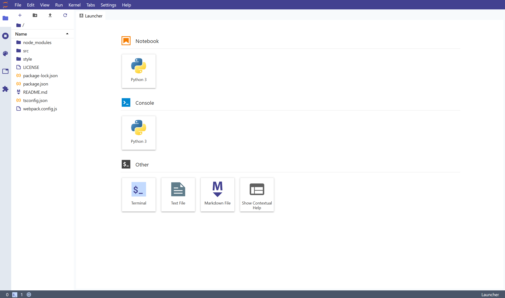

# JupyterLab Tailwind theme

A JupyterLab theme extension inspired by [Tailwind](https://tailwindcss.com/).


</br>


## Prerequisites

* JupyterLab

## Installation

```bash
jupyter labextension install jupyterlab-tailwind-theme
```

## Development

For a development install (requires npm version 4 or later), do the following in the repository directory:

```bash
npm install
jupyter labextension link .
```

To rebuild the package and the JupyterLab app:

```bash
npm run build
jupyter lab build
```
