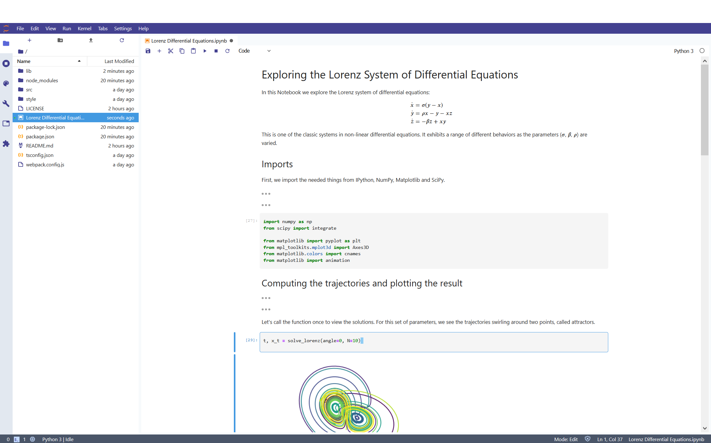
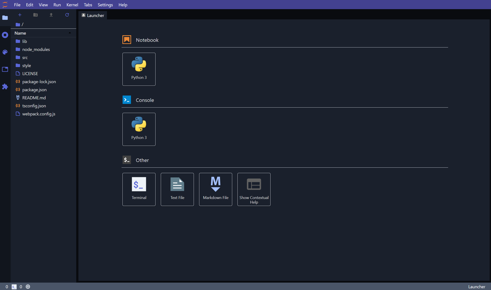
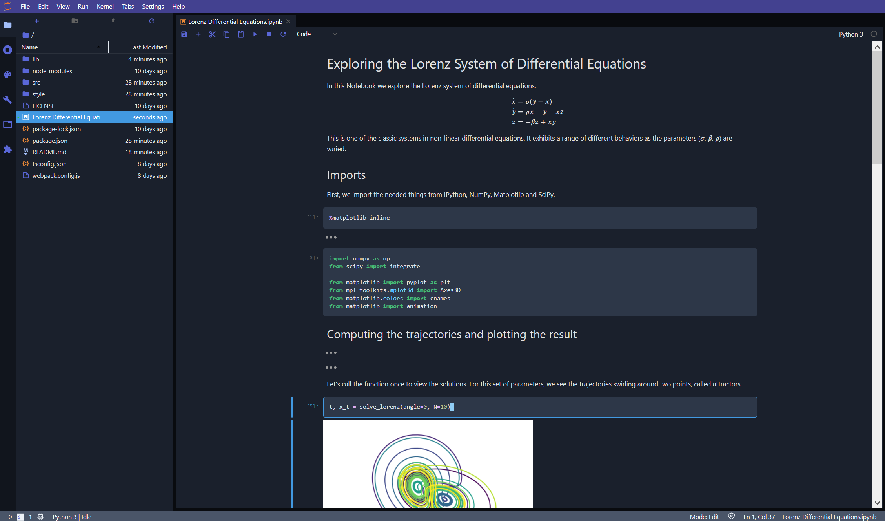
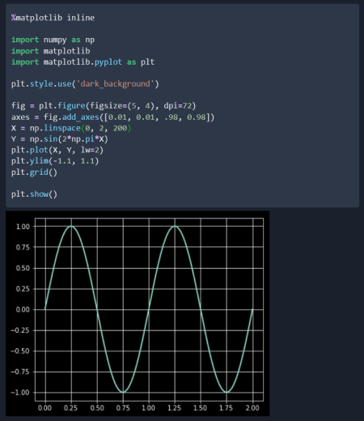

# JupyterLab Tailwind theme

A JupyterLab theme extension inspired by [Tailwind CSS](https://tailwindcss.com/).

## Changes (v3.0.1)
> ✨ Support for new release of JupyterLab (>= v3.0)
> ✨ Updated scrollbar & footer colors

Thanks to [Wiktor Flis (@WestedCrean)](https://github.com/WestedCrean) for contributing this update!

## Light theme

</br>
</br>

</br>
</br>
## Dark theme

</br>
</br>

</br>
</br>

Tip: To display matplotlib charts in dark mode execute `plt.style.use('dark_background')` after importing the package
</br>

</br>
</br>
</br>

## Prerequisites

* JupyterLab

## Installation

```bash
jupyter labextension install jupyterlab-tailwind-theme
```

## Development

For a development install, run the following commands in the repository directory:

```bash
npm install                   # install npm package dependencies
npm run build                 # optional build step if using TypeScript, babel, etc.
jupyter labextension install  # install the current directory as an extension
```

For incremental builds use:
```bash
jupyter lab --watch
```

To rebuild the package and the JupyterLab app:

```bash
npm run build
jupyter lab build
```

See also JupyterLab's documentation [Development workflow for source extensions](https://jupyterlab.readthedocs.io/en/stable/extension/extension_dev.html#development-workflow-for-source-extensions)
